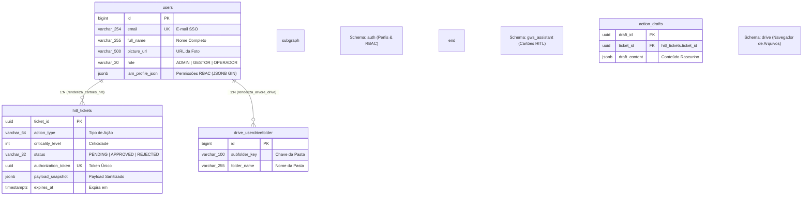

# Modelo de Dados PostgreSQL 17 — UI & Design System (`jorgete-ui`)

O subprojeto `jorgete-ui` contém a biblioteca centralizada de componentes visuais, o Design System e os elementos de interface compartilhados entre todos os módulos do ecossistema **Jorgete Cloud**.

Este documento especifica os **5 Schemas Canônicos de Domínio** do PostgreSQL 17 sob a perspectiva de integração das interfaces e componentes da `jorgete-ui`.

---

## 1. Visão Geral dos 5 Schemas Canônicos

| Schema | Domínio de Negócio | Foco Principal do Subprojeto `jorgete-ui` |
| :--- | :--- | :--- |
| `auth` | **IAM & Autenticação** | **Domínio de Renderização:** Componentes de Login SSO, Avatar do usuário, navegação RBAC e exibição de perfil baseado em `auth.users` e `iam_profile_json`. |
| `gws_assistant` | **Agentes GWS & HITL** | Componentes do Design System para exibição de modais e cartões de aprovação **HITL** (`hitl_tickets`) e pré-visualização de rascunhos (`action_drafts`). |
| `studio_web` | **Studio, RAG & Vetores** | Componentes de Canvas D3, leitores de roteiros e visualizadores de projetos (`projects`, `scripts`). |
| `drive` | **Governança Drive** | Componentes de árvore de arquivos e navegação pelas subpastas do Google Drive (`userdrivefolder`). |
| `telemetry_audit` | **Auditoria & Métricas** | Componentes de Dashboard e gráficos de monitoramento de consumo de tokens e latência (`telemetry_logs`). |

---

## 2. Diagrama Entidade-Relacionamento (ERD) - Foco UI & Frontend Integration



---

## 3. Especificação DDL dos 5 Schemas no PostgreSQL 17

### 3.1. Schema `auth` (Perfis de Usuário & IAM)

```sql
CREATE SCHEMA IF NOT EXISTS auth;

CREATE TABLE IF NOT EXISTS auth.users (
    id BIGSERIAL PRIMARY KEY,
    email VARCHAR(254) UNIQUE NOT NULL,
    full_name VARCHAR(255) DEFAULT '' NOT NULL,
    picture_url VARCHAR(500) DEFAULT '' NOT NULL,
    role VARCHAR(20) DEFAULT 'OPERADOR' NOT NULL CHECK (role IN ('ADMIN', 'GESTOR', 'OPERADOR')),
    has_chat_access BOOLEAN DEFAULT TRUE NOT NULL,
    has_studio_access BOOLEAN DEFAULT TRUE NOT NULL,
    has_cinema_access BOOLEAN DEFAULT FALSE NOT NULL,
    has_google_access BOOLEAN DEFAULT TRUE NOT NULL,
    has_dashboard_access BOOLEAN DEFAULT TRUE NOT NULL,
    iam_profile_json JSONB DEFAULT '{}'::jsonb NOT NULL,
    created_at TIMESTAMPTZ DEFAULT (now() AT TIME ZONE 'America/Cuiaba') NOT NULL
);

CREATE INDEX IF NOT EXISTS idx_auth_users_iam_profile_gin ON auth.users USING GIN (iam_profile_json jsonb_path_ops);
```

---

### 3.2. Schema `gws_assistant` (Componentes HITL)

```sql
CREATE SCHEMA IF NOT EXISTS gws_assistant;

CREATE TABLE IF NOT EXISTS gws_assistant.hitl_tickets (
    ticket_id UUID PRIMARY KEY DEFAULT gen_random_uuid(),
    session_id VARCHAR(128) NOT NULL,
    action_type VARCHAR(64) NOT NULL,
    criticality_level INT NOT NULL CHECK (criticality_level IN (0, 1, 2)),
    status VARCHAR(32) NOT NULL DEFAULT 'PENDING' CHECK (status IN ('PENDING', 'APPROVED', 'REJECTED', 'EXPIRED', 'CONSUMED')),
    authorization_token UUID NOT NULL DEFAULT gen_random_uuid() UNIQUE,
    payload_snapshot JSONB NOT NULL,
    created_at TIMESTAMPTZ NOT NULL DEFAULT (now() AT TIME ZONE 'America/Cuiaba'),
    expires_at TIMESTAMPTZ NOT NULL DEFAULT ((now() AT TIME ZONE 'America/Cuiaba') + INTERVAL '15 minutes')
);

CREATE TABLE IF NOT EXISTS gws_assistant.action_drafts (
    draft_id UUID PRIMARY KEY DEFAULT gen_random_uuid(),
    ticket_id UUID REFERENCES gws_assistant.hitl_tickets(ticket_id) ON DELETE CASCADE,
    tool_name VARCHAR(64) NOT NULL,
    draft_content JSONB NOT NULL,
    created_at TIMESTAMPTZ NOT NULL DEFAULT (now() AT TIME ZONE 'America/Cuiaba')
);
```

---

### 3.3. Schema `drive` (Subpastas Canônicas)

```sql
CREATE SCHEMA IF NOT EXISTS drive;

CREATE TABLE IF NOT EXISTS drive.userdrivefolder (
    id BIGSERIAL PRIMARY KEY,
    user_id BIGINT NOT NULL REFERENCES auth.users(id) ON DELETE CASCADE,
    subfolder_key VARCHAR(100) NOT NULL,
    folder_id VARCHAR(255) NOT NULL,
    folder_name VARCHAR(255) NOT NULL,
    created_at TIMESTAMPTZ DEFAULT (now() AT TIME ZONE 'America/Cuiaba') NOT NULL
);
```

---

### 3.4. Schema `studio_web` (Projetos & RAG)

```sql
CREATE SCHEMA IF NOT EXISTS studio_web;

CREATE TABLE IF NOT EXISTS studio_web.projects (
    project_id UUID PRIMARY KEY DEFAULT gen_random_uuid(),
    owner_id BIGINT REFERENCES auth.users(id) ON DELETE CASCADE,
    title VARCHAR(255) NOT NULL,
    description TEXT,
    settings JSONB NOT NULL DEFAULT '{}'::jsonb,
    created_at TIMESTAMPTZ NOT NULL DEFAULT (now() AT TIME ZONE 'America/Cuiaba')
);
```

---

### 3.5. Schema `telemetry_audit` (Dashboard de Auditoria)

```sql
CREATE SCHEMA IF NOT EXISTS telemetry_audit;

CREATE TABLE IF NOT EXISTS telemetry_audit.telemetry_logs (
    id BIGSERIAL PRIMARY KEY,
    user_id BIGINT REFERENCES auth.users(id) ON DELETE SET NULL,
    service_name VARCHAR(100) NOT NULL,
    model_name VARCHAR(100) DEFAULT 'gemini-3.6-flash' NOT NULL,
    prompt_tokens INTEGER DEFAULT 0 NOT NULL,
    completion_tokens INTEGER DEFAULT 0 NOT NULL,
    total_tokens INTEGER DEFAULT 0 NOT NULL,
    latency_ms INTEGER DEFAULT 0 NOT NULL,
    created_at TIMESTAMPTZ DEFAULT (now() AT TIME ZONE 'America/Cuiaba') NOT NULL
);
```

---

## 4. Diretrizes de Governança no Frontend

1. **Reatividade do JSONB (`iam_profile_json`):** A barra de navegação e os menus da UI utilizam as informações do payload JSONB para renderizar condicionalmente os módulos autorizados.
2. **Componentes HITL:** Os modais de aprovação renderizam o `payload_snapshot` e executam chamadas de aceite/rejeição enviando o `authorization_token`.
3. **Fuso Horário:** Formatação nativa de datas em `America/Cuiaba` (BRT/AMT).
